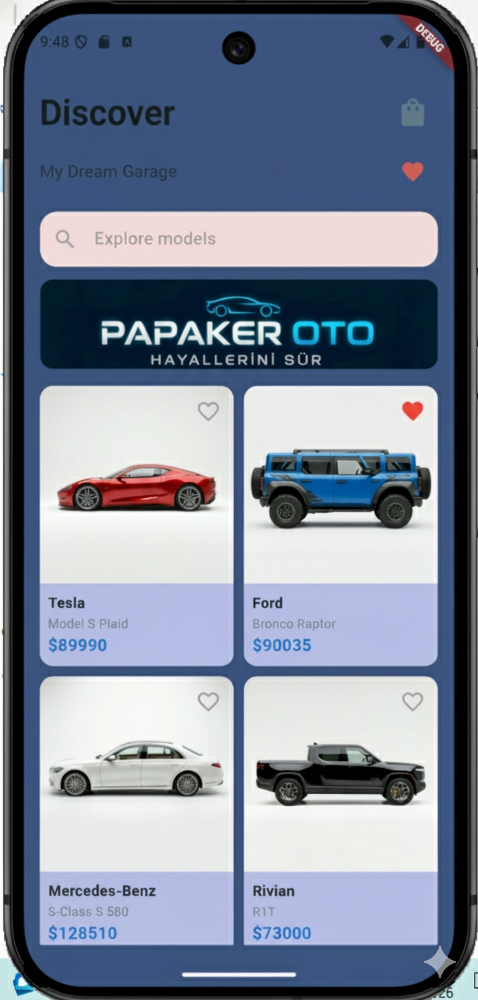
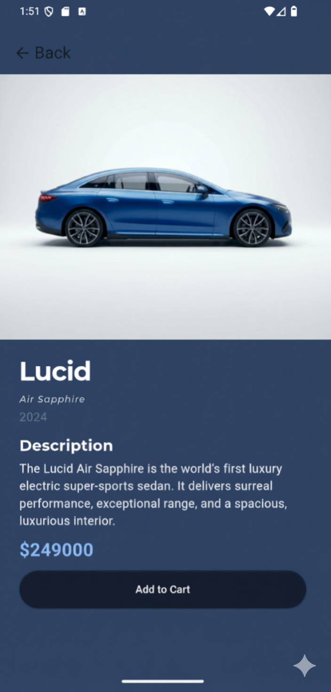
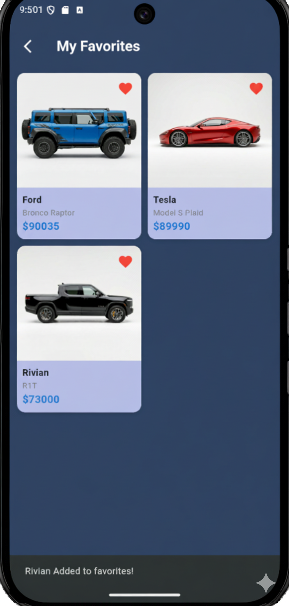
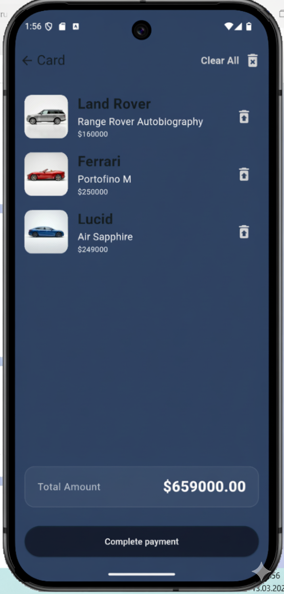
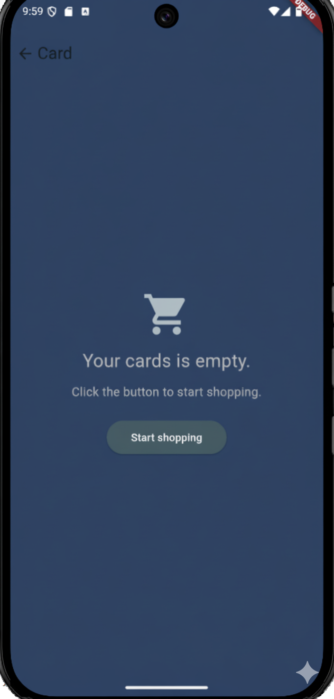

🏎️ E-AutoCatalog
E-AutoCatalog, kullanıcıların favori araçlarıyla hayallerindeki galeriyi oluşturmalarını sağlayan, 4 ana ekrandan oluşan modern bir Flutter uygulamasıdır.

🚀 Proje Hakkında
Uygulama; şık kart tasarımları, animasyonlu ürün detay geçişleri ve akıcı bir kullanıcı deneyimi sunar. Ana ekrandaki araç kartları üzerinden favori yönetimi yapılabilir; yapılan favori değişiklikleri, uygulama genelinde eş zamanlı olarak senkronize edilir. Sepet sistemi sayesinde araçlar detay sayfalarından sepete kolayca aktarılabilir, tekil veya toplu silme işlemleriyle yönetilebilir. Sepetin boş olması durumunda kullanıcıyı ana sayfaya yönlendiren pratik "Alışverişe Başla" butonu ile kullanıcı akışı kesintisiz tutulur.

**Ana Ekran (home_screen):** Araçların kartlar halinde listelendiği merkez ekran. 
    - Kartlara tıklandığında, ürüne özel detay sayfası animasyonlu bir geçişle açılır.
    - Sağ üst köşedeki ikonlar üzerinden hızlıca "Favoriler" ve "Sepet" ekranlarına geçiş yapılabilir.
- **Detay Sayfası:** Seçilen aracın tüm teknik detaylarına erişim sağlar. "Sepete Ekle" butonu ile ürün kolayca sepete aktarılır.
- **Favori Yönetimi:** Kartlar üzerindeki favori butonları ile araçlar favorilere eklenir. Sağ üstteki kalp ikonu ile favori ekranına gidilir. Buradan çıkarılan bir araç, ana ekranda da eş zamanlı olarak favori durumundan çıkarılır.
- **Sepet Sistemi:** Sepet ekranı, eklenen ürünleri sıralı bir şekilde gösterir.
    - Her ürünün karşısındaki ikon ile tekli silme işlemi yapılabilir.
    - Sağ üstteki "Tümünü Temizle" butonu ile sepet tek hamlede boşaltılır.
    - Sepet boşsa kullanıcıyı karşılayan "Alışverişe Başla" butonu, kullanıcıyı otomatik olarak ana sayfaya yönlendirir.

## 📱 Ekran Görüntüleri

| Ana Ekran | Ürün Detayı | Favoriler | Sepet | Boş Sepet |
| :---: | :---: | :---: | :---: | :---: |
|  |  |  |  |  |

## 🛠 Teknik Bilgiler

- **Flutter Sürümü:** 3.41.4 (Stable Channel)
- **Dart Sürümü:** 3.11.1
- **DevTools:** 2.54.1

⚙️ Kurulum Adımları
  # 1. Repoyu klonlayın
git clone https://github.com/KULLANICI_ADINIZ/E-AutoCatalog.git
cd E-AutoCatalog

# 2. Bağımlılıkları yükleyin
flutter pub get

# 3. Uygulamayı çalıştırın
flutter run

